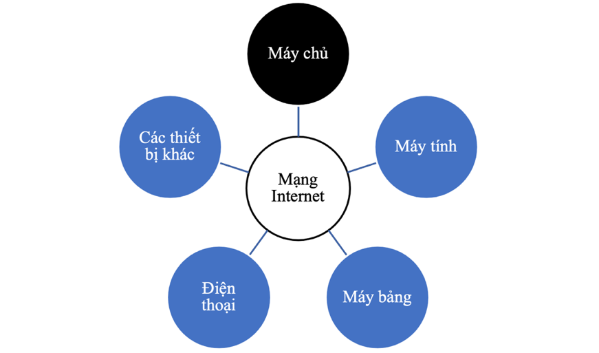
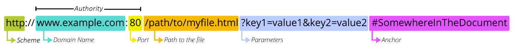
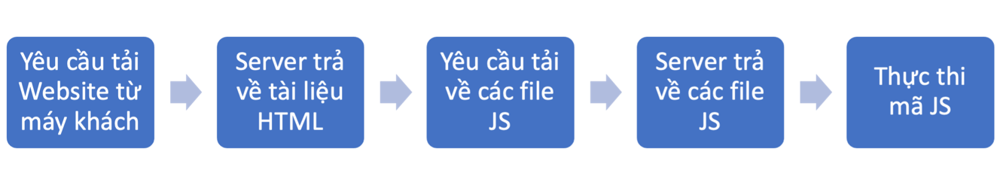
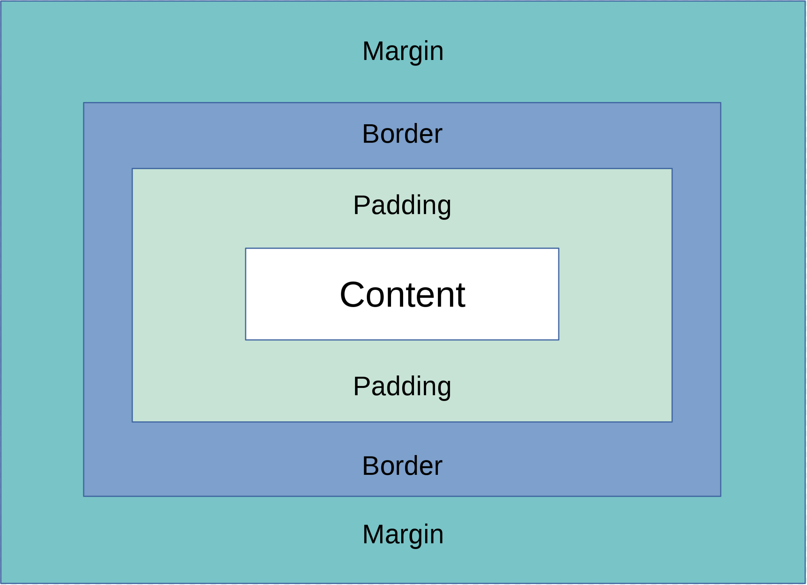
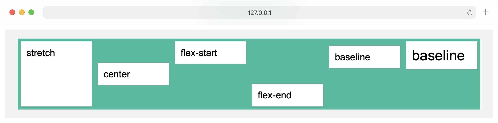

# Tổng quát
#### 1. W3C là gì?
- W3C(World Wide Web Consortium) là tổ chức phi lợi nhuận quốc tế do **Tim Berners-Lee** thành lập năm **1994**
- Mục tiêu: Phát triển **tiêu chuẩn Web**, đảm bảo tính **tương thích** và **tiên tiến** của công nghệ Web.
- Thành viên: **Công ty công nghệ, tổ chức học thuật, cá nhân** trên toàn thế giới.

#### 2. Website là gì?
- Website là tập hợp các trang Web được truy cập qua **tên miền chung** hoặc **URL**.
- Nội dung trang Web: **Văn bản, hình ảnh, video, âm thanh, liên kết**.
- **URL (Uniform Resource Locator)** là địa chỉ duy nhất của trang Web.

#### 3. Phân loại Website
- **Cá nhân**: Blog, portfolio, chia sẻ sở thích.
- **Doanh nghiệp**: Cung cấp thông tin sản phẩm/dịch vụ, giao tiếp khách hàng.
- **Giáo dục**: Học trực tuyến, tài liệu, trường học.
- **Giải trí**: Video, trò chơi, âm nhạc, sự kiện trực tuyến.

#### 4. Hoạt động của Website
- Website lưu trữ trên **máy chủ (Server)**, truy cập bởi **máy khách (Client)**.
- Máy khách: **Máy tính, điện thoại, máy tính bảng**.
- Giao tiếp qua **HTTP/HTTPS** để đảm bảo an toàn & hiệu quả.
- Máy chủ xử lý yêu cầu và trả về nội dung phù hợp.

#### 5. Mạng máy tính là gì?
- Tập hợp thiết bị kết nối để **trao đổi dữ liệu & tài nguyên** qua **giao thức & phương tiện truyền thông**.
- **Yêu cầu bắt buộc** để Website hoạt động.
- Website thường truy cập qua **Internet**, nhưng có thể triển khai trên **mạng LAN**.
#### 6. Các loại mạng phổ biến
- **Mạng cục bộ (LAN - Local Area Network)**:
    - Kết nối **phạm vi nhỏ** (tổ chức, công ty, trường học).
- **Mạng diện rộng (WAN - Wide Area Network)**:
    - Kết nối **nhiều LAN**, phạm vi **thành phố/quốc gia**.
    - **ISP (Nhà cung cấp dịch vụ Internet)** quản lý WAN và cung cấp truy cập Internet.
- **Mạng Internet**:
    - Gồm các **mạng WAN kết nối qua IXP (Internet eXchange Point)**.
    - **≈ 600 IXP** trên thế giới (số liệu 2022).

#### 7. Vai trò của mạng máy tính đối với Website
- **Kết nối máy chủ Web**, đảm bảo **khả dụng & hiệu quả**.
- **Bảo mật mạng** ngăn chặn tấn công & rò rỉ thông tin.
- **Website có thể chạy trên máy tính đơn** (vừa là máy khách, vừa là máy chủ).

#### 8. Thành phần chính của một Website
- **Máy khách (Client)**: Chạy **trình duyệt Web** để gửi yêu cầu.
- **Máy chủ (Server)**: Cung cấp **dữ liệu & dịch vụ**.
- **Hệ thống mạng**: Kết nối **máy khách & máy chủ**.

#### 9. Phân loại Website
##### **Web tĩnh (Static Web)**
- Nội dung **cố định**, không thay đổi theo thời gian.
- **Cách hoạt động**:
    1. Người dùng gửi **request** qua trình duyệt (**HTTP**).
    2. **Máy chủ Web** gửi lại **file HTML tĩnh**.
    3. Trình duyệt **hiển thị nội dung**.
##### **Web động (Dynamic Web)**
- **Nội dung thay đổi** theo yêu cầu của người dùng.
- **Cách hoạt động**:
    1. Người dùng gửi **request**.
    2. Máy chủ Web chuyển yêu cầu đến **máy chủ ứng dụng**.
    3. Máy chủ ứng dụng **chạy chương trình/kịch bản** để tạo trang HTML.
    4. Nếu cần, máy chủ ứng dụng lấy **dữ liệu từ máy chủ dữ liệu**.
    5. HTML được **tạo động** và gửi lại trình duyệt qua **HTTP Response**.
    6. Trình duyệt **hiển thị nội dung**.


#### 10. Công nghệ Web động
- **Máy chủ Web**: IIS, Apache, Nginx...
- **Công nghệ phía máy chủ**: JSP, ASP, PHP...
- **Máy chủ dữ liệu**: MySQL, PostgreSQL, SQL Server, MongoDB...

#### 11. Trình duyệt Web có quan tâm Web tĩnh hay động không?
- **Không**. Trình duyệt chỉ **gửi yêu cầu & hiển thị nội dung HTML**.

#### 12. Đường dẫn Web (URL) là gì?
- URL (**Uniform Resource Locator**) là **chuỗi ký tự xác định vị trí tài nguyên trên Web**.
- Mỗi URL **duy nhất**, có thể trỏ đến: **trang HTML, tài liệu CSS, hình ảnh…**
- URL có thể **không còn tồn tại hoặc bị chuyển đi** trong Web động.

#### 13. Ví dụ về URL
- `https://developer.mozilla.org`
- `https://developer.mozilla.org/en-US/docs/Learn/`
- `https://developer.mozilla.org/en-US/search?q=URL`

#### 14. Thành phần của một URL
1. **Scheme (Giao thức)**: HTTP, HTTPS (xác định phương thức truyền dữ liệu).
2. **Authority (Địa chỉ & cổng)**:
    - **Địa chỉ**: Tên miền (`www.example.com`) hoặc **địa chỉ IP** (`102.39.23.201`).
    - **Cổng**:
        - HTTP sử dụng **cổng 80**.
        - HTTPS sử dụng **cổng 443**.
3. **Path (Đường dẫn)**: Xác định tài nguyên trên máy chủ Web.
4. **Parameters (Tham số)**: Gửi kèm dữ liệu đến máy chủ (dạng `key=value`).
5. **Anchor (Hash #)**: Đánh dấu vị trí trong tài liệu HTML, giúp điều hướng nhanh.


#### 15. Trình duyệt Web là gì?
- **Phần mềm** giúp **truy cập thông tin trên Internet**.
- Đọc **tài liệu HTML** từ **máy chủ Web** và **hiển thị nội dung**.

#### 16. Tại sao cần kiểm tra trang Web trên nhiều trình duyệt?
- **Mỗi trình duyệt hiển thị trang Web khác nhau** do **cách xử lý mã HTML, CSS, JavaScript khác nhau**.
- Đảm bảo **tương thích & trải nghiệm nhất quán** trên nhiều trình duyệt.

#### 17. Quy trình phát triển web

#### 20. Các nguyên tắc thiết kế Web cơ bản?
- Hiển thị **thông tin quan trọng trong màn hình đầu tiên**.
- **Nhóm các mục liên quan**, giới hạn số lượng nhóm.
- **Tiêu đề rõ ràng, thanh điều hướng tiện lợi**.
- **Sử dụng quy ước điều hướng quen thuộc** (như bấm logo về trang chủ).

#### 21. Những yếu tố đảm bảo khả năng tương thích của Website?
- Hoạt động trên **nhiều trình duyệt**.
- Hoạt động trên **nhiều hệ điều hành**.
- Hoạt động trên **nhiều thiết bị**.
- Hỗ trợ **nhiều phiên bản trình duyệt, hệ điều hành**.

#### 22. Website cần đảm bảo tiếp cận với những đối tượng nào?
- Người **có vấn đề về thị lực**.
- Người **có vấn đề về thính lực**.
- Người **có vấn đề về vận động**.
- Người **có vấn đề về trí nhớ, nhận thức**.
- Người **sử dụng thiết bị hỗ trợ đặc biệt**.

#### 23. Tại sao cần thiết kế Web đáp ứng (Responsive Design)?
- **Người dùng truy cập Web từ nhiều loại thiết bị**.
- **60% truy cập mạng đến từ thiết bị di động**.
- **40% người dùng sẽ rời bỏ nếu Web hiển thị không tốt**.
- **Google ưu tiên Website có thiết kế tốt trên thiết bị di động**.

#### 24. Cấu trúc cơ bản của tài liệu HTML?
- **DOCTYPE** xác định phiên bản HTML.
- Thẻ `<html>...</html>` bao quanh toàn bộ tài liệu.
- Thẻ `<head>...</head>` chứa thông tin về tài liệu.
- Thẻ `<body>...</body>` chứa nội dung hiển thị.

#### 25. Các phiên bản HTML quan trọng?
- **HTML 1.0 (1993)**: Phiên bản đầu tiên, không trở thành chuẩn.
- **HTML 2.0 (1995-1996)**: Chuẩn đầu tiên (RFC 1866), hỗ trợ thẻ cơ bản.
- **HTML 3.2 (1996)**: Thêm **CSS, kịch bản (scripts), bảng (tables), applets**.
- **HTML 4.0 (1997)**: Hỗ trợ đầy đủ **đa phương tiện, CSS2, CSS3**.
- **XHTML 1.0 (2000)**: Cải tiến HTML4, sử dụng **cú pháp XML**.
- **XHTML 1.1 (2001)**: Yêu cầu **nghiêm ngặt hơn, làm việc với XML**.
- **HTML5 (2008 - nay)**: Thêm **video, audio, canvas, đồ họa vector**.

#### 26. CSS - Ngôn ngữ định dạng
- **CSS1** (12/1996): Định dạng font, màu sắc, căn lề, viền, khoảng cách… Hiện không còn bảo trì.
- **CSS2** (05/1998): Kế thừa CSS1, bổ sung thiết lập vị trí. CSS2.1 sửa lỗi và bổ sung một số nội dung.
- **CSS3** (1999): Thêm các định dạng như bo góc, đổ bóng, chuyển động, flexbox, grid layout.
#### 27. JS trên web server

#### 28. Các loại dịch vụ lưu trữ Web
- **Web hosting**: Lưu nhiều Web trên 1 máy chủ. Mỗi Web có phân vùng riêng. Kinh tế → chia sẻ chi phí.
- **Windows hosting**: Lưu Web trên máy chủ chạy **Windows Server**.
- **Linux hosting**: Lưu Web trên máy chủ chạy **Linux Server**.
- **Free Web hosting**: Miễn phí, thường có **quảng cáo** và **hạn chế**. Có thể dùng tên miền phụ/thư mục.
- **Reseller hosting**: Cho phép **phân bổ lại tài nguyên** (ổ cứng, băng thông...) cho tổ chức/cá nhân khác.
- **VPS hosting**: Máy chủ ảo riêng (**Virtual Private Server**). Mỗi VPS hoạt động độc lập, có thể **khởi động lại riêng biệt**.
- **Email hosting**: Gửi email **gắn với tên miền** riêng. Tùy chỉnh cấu hình, số lượng tài khoản, dung lượng...
- **File hosting**: Lưu trữ tệp tin online. Truy cập qua **FTP hoặc công cụ chuyên biệt** để tải/lưu/chia sẻ.
# HTML
```html fold
<!DOCTYPE html> <!-- Xuất hiện từ HTML5, must have-->
<html lang="en">
<head>
    <style>
        body {
            max-width: 60%;
            margin: 0 auto;
        }
    </style>

    <title>Tiêu đề trang Web</title>
    <!-- Icon -->
    <link rel="icon" type="image/png" sizes="192x192" href="/android-chrome-192x192.png">
    <link rel="icon" type="image/png" sizes="512x512" href="/android-chrome-512x512.png">
    <link rel="apple-touch-icon" sizes="180x180" href="/apple-touch-icon.png">
    <link rel="icon" type="image/x-icon" href="/favicon.ico">
    <!-- The meta tag -->
    <meta charset="UTF-8">
    <meta name="description" content="Thiết kế Website">
    <meta name="keywords" content="HTML, CSS, JavaScript">
    <meta name="author" content="Dương Minh">
    <meta name="viewport" content="width=device-width, initial-scale=1.0">
    <!-- The Base Tag -->
    <!--<base href="https://base.com/" target="_blank">--> 
    <!-- Tag này hay vì như tên nó, base url, nghĩa là toàn bộ href link trong file sẽ có đầu là https://base.com/ <a href="article.html> thì sẽ là https://base.com/article.html -->
</head>
<body>
    <!-- Phần tử ngữ nghĩa (tạo context cho web) -->
    <!-- Phần tử header -->
    <header>
    <h1>Chào mừng đến với trang Web</h1>
    </header>
    <!-- Thanh điều hướng -->
    <nav>
        <a href="/html/">HTML</a> |
        <a href="/css/">CSS</a> |
        <a href="/js/">JavaScript</a> |
        <a href="/jquery/">jQuery</a>
    </nav>
    <!-- Phần tử footer -->
    <footer>
        <p>Đăng bởi: Dương Minh</p>
        <p>Liên hệ: <a href="mailto:minhpd@mail.com">minhpd@mail.com</a></p>
    </footer>

    <hr> <!-- Ngăn cách giữa các phần tử -->

    <!-- Block vs inline -->
     <div style="background-color: lightblue; padding: 10px;">
        Đây là một đoạn văn bản trong phần tử khối. Nó chiếm hết cả 1 dòng
     </div>
     <div>
        <span style="color: red;">Đây là một phần tử nội tuyến</span>, 
        nó chỉ chiếm không gian cần thiết và không tạo ngắt dòng. 
        <span style="color: green;">Ví dụ khác về phần tử nội tuyến</span>.
     </div>

    <!-- Liên kết -->
    <a href="https://www.neu.edu.vn">Đến trang www.neu.edu.vn</a>
    <a href="article.html">Đọc thêm bài viết</a>
    <a class="readmore" href="article.html" title="Đọc thêm về ngôn ngữ lập trình JavaScript">Đọc thêm</a>

    <!-- Hình ảnh -->
    
     <!-- KHÔNG NHẤT THIẾT PHẢI CÓ "" NẾU ĐÃ FILE NAMING CHUẨN -->

    <figure> <!-- Tạo 1 figure riêng cho ảnh (gồm 1 block ảnh + caption của nó luôn) -->
    
    <figcaption>Hình 1.3 Trường Đại học</figcaption>
    </figure>

    <!-- Chú thích -->
    <p title="Xin chào" sytle="color:red">Đây là một đoạn văn</p>

    <!-- Danh sách -->
    <ul style="list-style-type:square">
        <li>boolean</li>
        <li>null</li>
        <li>undefined</li>
        <li>number</li>
        <li>string</li>
        <li>symbol</li>
    </ul>

    <ol style="list-style-type:decimal-leading-zero" start="5">
        <li>boolean</li>
        <li>null</li>
        <li>undefined</li>
        <li>number</li>
        <li>string</li>
        <li>symbol</li>
    </ol>

    <!-- Mô tả (dl - definition list, dt - term, dd - description)-->
    <dl>
        <dt>HTML</dt>
        <dd>Ngôn ngữ đánh dấu văn bản</dd>
        <dt>CSS</dt>
        <dd>Cascading Style Sheets</dd>
    </dl>

    <!-- Tiêu đề phụ -->
    <section>
    <h2>Phạm Dương Minh</h2>
    
    <q style="display: block" id="myquote">Nếu không có đam mê, sẽ không có năng lượng</q>
    <div class="contact">
        <h4 class="contact-title">Hòm thư:</h4>
        <a href="mailto:(webmail@gmail.com)" id="info-email">minhpd@mail.com</a>
        <h4 class="contact-title">Điện thoại:</h4>
        <a href="tel:+84912345679" id="phone">+84912345679</a>
        <h4 class="contact-title">Địa chỉ:</h4>
        <a href="https://www.google.com/maps" target="_blank" id="info-address">207 Giải phóng</a>
    </div>
    </section>

    <!-- Tag metadata (không tác dụng gì lắm nhưng chắc dùng để css cho dễ) -->
    <address>
        Biên tập bởi Dương Minh<br>
        Trang chủ: https://minh-blogs.Web.app
    </address>
    <p><cite>Tác phẩm tiếng thét (The Scream)</cite> được sáng tác bởi Edvard Munch năm 1893</p>
    <time datetime="2022-10-25">25/10/2022</time>

    <!-- Formating -->
    <p><b>Chữ in đậm</b></p>
    <p><strong>Chữ chứa nội dung quan trọng</strong></p>
    <p><i>Chữ in nghiêng</i></p>
    <p><em>Nội dung nhấn mạnh trong văn bản</em></p>
    <p><mark>Đánh dấu văn bản</mark></p>
    <p><small>Văn bản chữ nhỏ</small></p>
    <p><del>Văn bản bị xóa</del></p>
    <p><s>Văn bản không còn đúng nữa</s></p>
    <p><u>Văn bản viết sai (chính tả)</u></p>
    <p><ins>Văn bản chèn thêm</ins></p>
    <p>Chỉ số dưới: H<sub>2</sub>O</p>
    <p>Chỉ số trên: X<sup>2</sup> + Y<sup>2</sup> = Z<sup>2</sup></p>

    <!-- Nội dung chính -->
    <main>
    <article>
        <h2>Ngôn ngữ đánh dấu văn bản HTML</h2>
        <div class="content">
        <a href="article.html"></a>
        <div>
            <p><em>Ngôn ngữ HTML là gì?</em></p>
            <p><abbr title="Hypertext Markup Language">HTML</abbr> là ngôn ngữ lập trình dùng để xây dựng và cấu trúc lại các thành phần có trong Website...</p>
        </div>
        </div>
        <a class="readmore" href="article.html">Đọc thêm</a>

        <details>
            <summary>Thông Tin Sản Phẩm</summary>
            <p>Sản phẩm này là một thiết bị điện tử hiện đại với nhiều tính năng độc đáo.</p>
            <p>Nó được thiết kế để đáp ứng nhu cầu sử dụng hàng ngày của bạn.</p>
        </details>
    </article>
    </main>

    <!-- Chú thích phụ -->
    <aside>
    <h4>Tiêu đề phụ</h4>
    <p>Đoạn văn trong tiêu đề phụ</p>
    </aside>

    <!--Code-->
    <code>
        <pre> <!-- Xuống dòng trong code cx là xuống dòng khi render -->
        class HelloWorld {
         public static void main(String[] args) {
          System.out.println("Hello, World!"); 
         }
        }
        </pre>
    </code>

    <!-- Bảng -->
    <table>
    <caption style="caption-side: bottom;">Danh sách các loại ngôn ngữ</caption>
    <thead>
        <tr>
        <th>Ngôn ngữ</th>
        <th>Mô tả</th>
        </tr>
    </thead>
    <tbody>
        <tr>
        <td>HTML</td>
        <td>Ngôn ngữ đánh dấu văn bản</td>
        </tr>
        <tr>
        <td>CSS</td>
        <td>Cascading Style Sheets</td>
        </tr>
    </tbody>
    <tfoot>
        <tr>
        <td colspan="2">Nguồn: Wikipedia</td>
        </tr>
    </tfoot>
    </table>

    <!-- Liên kết dấu trang -->
    <h2 id="C2">Chương 2</h2>
    <a href="#C2">Chuyển đến Chương 2</a>

    <!-- Multimedia -->
        <!--Đính từng url vào VỊ TRÍ CỤ THỂ TRÊN ẢNH-->
        <h1>Bản đồ</h1>
        
        
        <map name="map">
        <area shape="rect" coords="0,0,100,100" href="page1.html" alt="Khu vực 1">
        <area shape="circle" coords="200,200,50" href="page2.html" alt="Khu vực 2">
        <area shape="poly" coords="300,100,400,200,350,300,250,250" href="page3.html" alt="Khu vực 3">
        </map>
        <!-- Vector images -->
        <svg width="370" height="200" viewBox="0 0 30 20" xmlns="http://www.w3.org/2000/svg" version="1.1">
            <rect width="30" height="20" fill="#da251d" />
            <polygon points="15,4 11.47,14.85 20.71,8.15 9.29,8.15 18.53,14.85" fill="#ff0" />
        </svg>

        <svg width="200" height="100" xmlns="http://www.w3.org/2000/svg"> 
            <ellipse cx="100" cy="50" rx="80" ry="30" fill="yellow" />
        </svg>

        <svg width="200" height="100" xmlns="http://www.w3.org/2000/svg">
            <text x="20" y="50" font-family="Arial" font-size="20" fill="blue">Hello SVG!</text>
        </svg>

        <svg width="300" height="200">
            <polygon points="100,10 10,78 40,198 160,198 190,78"
              style="fill:lime;stroke:purple;stroke-width:5;fill-rule:evenodd;" />
        </svg>

        <svg width="400" height="180">
            <rect x="50" y="20" rx="20" ry="20" width="150" height="150"
              style="fill:red;stroke:black;stroke-width:5;opacity:1" />
        </svg>

        <svg width="400" height="100">
            <rect width="400" height="100" style="fill:rgb(0,0,255);stroke-width:10;stroke:rgb(0,0,0)" />
        </svg>

        <svg width="100" height="100">
            <circle cx="50" cy="50" r="40" stroke="green" stroke-width="4" fill="yellow" />
        </svg>

        <!--Audio-->
        <audio controls>
            <source src="horse.mp3" type="audio/mpeg">
            Your browser does not support the audio element.
        </audio>
        <!-- Video (có vài thuộc tính để nâng cao UX - autoplay, loop, controls, preload, ....)-->
        <video width="320" height="240" controls>
            <source src="movie.mp4" type="video/mp4">
            <source src="movie.ogg" type="video/ogg">
            Your browser does not support the video tag.
        </video> 
        <!-- Video có caption (đánh thêm thuộc tính poster để làm thumbnail) -->
        <video width="320" height="240" controls>
            <source src="movie.mp4" type="video/mp4">
            <track src="captions_vtt.vtt" kind="captions" srclang="en" label="English">
            <track src="captions_vtt_fr.vtt" kind="captions" srclang="fr" label="French">
            Trình duyệt của bạn không hỗ trợ thẻ video.
        </video>
        <!-- Iframe classic -->
        <iframe width="560" height="315" src="https:// youtu.be/embed/id" title="YouTube" frameborder="0" allow="accelerometer; autoplay; clipboard-write; encrypted-media; gyroscope; picture-in-picture" Allowfullscreen>
        </iframe>
        <!-- Embeded (pdf, ....) -->
        <embed src="https://minh-blogs.Web.app/files/article.pdf" width="500" height="375" type="application/pdf">


    <!-- Form -->
    <form action="save.php">
        <h2>Văn bản</h2>
        <input type="text" placeholder="Văn bản">
        <input type="email" placeholder="Email">
        <input type="number" placeholder="Số">
        <input type="range">
        <input type="search" placeholder="Tìm kiếm">
        <input type="tel" placeholder="Số điện thoại">
        <input type="password" placeholder="Mật khẩu">
        <input type="url" placeholder="URL">
        
        <h2>Thời gian</h2>
        <input type="time">
        <input type="week">
        <input type="month">
        <input type="date">
        <input type="datetime-local">
        
        <h2>Lựa chọn</h2>
        <input type="checkbox"> Checkbox
        <select>
            <option>Option 1</option>
            <option>Option 2</option>
        </select>
        <input type="radio" name="radio"> Radio 1
        <input type="radio" name="radio"> Radio 2
        <datalist id="datalist">
            <option value="Option A">
            <option value="Option B">
        </datalist>
        <input list="datalist" placeholder="Datalist">
        <label for="course-select">Chọn khóa học:</label>
        <select id="course-select">
        <optgroup label="Khóa học lập trình">
        <option>Python</option>
        <option>Java</option>
        <option>JavaScript</option>
        </optgroup>
        <optgroup label="Cơ sở dữ liệu">
        <option>MySQL</option>
        <option>SQL Server</option>
        <option>MongoDB</option>
        </optgroup>
        </select>
        
        <h2>Nút bấm</h2>
        <input type="image" src="button.png" alt="Hình ảnh">
        <input type="reset" value="Reset">
        <input type="submit" value="Submit">
        <input type="button" value="Button">
        <button>Nút bấm</button>

        
        
        <h2>Các phần tử khác</h2>
        <input type="color">
        <input type="hidden" name="userID" value="23114306030131"> <!-- Không hiển thị trên giao diện nhưng vẫn về database -->
        <input type="file">
        Các yêu cầu khác: <textarea id="request" name="request" style="display: block" rows="10" cols="40"></textarea>
        <label for="file">Đang tải file:</label>
        <progress id="file" value="32" max="100"> 32% </progress>
    </form>

    <!--Dynamic form-->
    <form oninput="x.value=parseInt(a.value) + parseInt(b.value)">
        0 <input type="range" id="a" name="a" value="50"> 100 +
        <input type="number" id="b" name="b" value="50"> =
        <output name="x"></output>
        <!-- Thuộc tính value: Giá trị mặc định của ô nhập -->
        <input type="text" name="firstname" value="John">

        <!-- Thuộc tính readonly: Chỉ đọc, không thể chỉnh sửa -->
        <input type="text" name="firstname" value="John" readonly>

        <!-- Thuộc tính disabled: Vô hiệu hóa ô nhập -->
        <input type="text" name="firstname" value="John" disabled>

        <!-- Thuộc tính size: Xác định kích thước ô nhập -->
        <input type="text" name="firstname" value="John" size="40">

        <!-- Thuộc tính maxlength: Giới hạn số ký tự tối đa -->
        <input type="text" name="firstname" maxlength="10">

        <!-- Thuộc tính autocomplete: Bật/tắt tự động điền -->
        <input type="email" name="email" autocomplete="off">

        <!-- Thuộc tính novalidate: Bỏ qua kiểm tra dữ liệu khi submit form -->
        <form action="/action_page.php" novalidate>
        <input type="email" name="user_email">
        <input type="submit">
        </form>

        <!-- Thuộc tính autofocus: Tự động focus vào ô nhập khi tải trang -->
        <input type="text" name="fname" autofocus>

        <!-- Thuộc tính height & width: Định kích thước hình ảnh input -->
        <input type="image" src="img_submit.gif" alt="Submit" width="48" height="48">

        <!-- Thuộc tính list: Gợi ý giá trị nhập từ danh sách -->
        <input list="browsers">
        <datalist id="browsers">
        <option value="Internet Explorer">
        <option value="Firefox">
        <option value="Chrome">
        <option value="Opera">
        <option value="Safari">
        </datalist>

        <!-- Thuộc tính min & max: Giới hạn giá trị nhập vào -->
        <input type="date" name="bday" max="1979-12-31">
        <input type="date" name="bday" min="2000-01-02">
        <input type="number" name="quantity" min="1" max="5">

        <!-- Thuộc tính multiple: Cho phép chọn nhiều giá trị -->
        <input type="file" name="img" multiple>

        <!-- Thuộc tính pattern: Xác định biểu thức chính quy kiểm tra đầu vào -->
        <input type="text" name="country_code" pattern="[A-Za-z]{3}" title="Mã quốc gia gồm 3 chữ cái">

        <!-- Thuộc tính placeholder: Hiển thị gợi ý nhập liệu -->
        <input type="text" name="fname" placeholder="First name">

        <!-- Thuộc tính required: Bắt buộc nhập dữ liệu -->
        <input type="text" name="username" required>

        <!-- Thuộc tính step: Xác định bước nhảy của số nhập vào -->
        <input type="number" name="points" step="3">
    </form>

</body>
</html>

```
# CSS
```css
body{
    background-color: blue !important;
    /*Khai báo !important khiến cho việc khai báo một thuộc tính kiểu trở lên quan trọng*/

    all:inherit initial unset;
    /*initial: thiết lập toàn bộ các thuộc tính trở về giá trị mặc định.
    inherit: thiết lập toàn bộ các thuộc tính kế thừa từ phần tử cha.
    unset (mặc định): thiết lập toàn bộ các thuộc tính kế thừa từ phần tử cha nếu đó là những thuộc tính mặc định sẽ kế thừa từ cha.*/
}
    /*Bộ chọn tổ hợp (Combinator)
    thể hiện mối quan hệ giữa các selector, cho phép kết hợp các selector lại với nhau dưới dạng các chuỗi ký tự.*/
    h1 p{}
    /*Bộ chọn con cháu (sử dụng dấu khoảng trắng)*/
    h2 > p{}
    /*Bộ chọn con (sử dụng dấu >)*/
    h3 + p{}
    /*Bộ chọn anh em liền kề (sử dụng dấu +)*/
    h4 ~ p{}
    /*Bộ chọn anh em (sử dụng dấu ~)*/


    /*Bộ chọn lớp giả
    được sử dụng để xác định tình trạng đặc biệt của một phần tử */
    selector:pseudo-class {
        property:value;
       }

    a:link {
        color: #FF0000;
       }
    a:visited {
        color: #00FF00;
       }
    a:hover {
        color: #FF00FF;
       }
    /*a:hover phải sau a:link và a:visited*/
    a:active {
        color: #0000FF;
       }
    /*a:active phải sau a:hover*/

    /*Lớp giả :first-child so khớp với một phần tử là con đầu của phần tử khác
    Ví dụ: Chọn ra thẻ <p> đầu tiên mà không chọn các thẻ <p> khác.*/
    p:first-child 
    {
        color: blue;
    }
    
    /*Chọn phần tử <input> đã được chọn (checked)*/
    input:checked{}

    /*Chọn phần tử <input> bị vô hiệu hóa (disabled)*/
    input:disabled{}

    /*Chọn phần tử <p> không có con*/
    p:empty{}

    /*Chọn phần tử <input> được không bị vô hiệu hoá*/
    input:enabled{}

    /*<input> có giá trị không hợp lệ*/
    input:invalid{}

    /*<p> với một giá trị thuộc tính lang bắt đầu với "it"*/
    p:lang(it){}

    /*<p> là con cuối cùng*/
    p:last-child{}

    /*Không phải là <p>*/
    :not(p){}

    /*<p> là con thứ n*/
    p:nth-child(n){}

    /*<p> là con thứ n của cha, kể từ con cuối cùng*/
    p:nth-last-child(n){}

    /*<p> là con duy nhất*/
    p:only-child{}

    /*<input> với một giá trị không nằm trong khoảng*/
    input:out-of-range{}

    /*<input> với thuộc tính "readonly"*/
    input:read-only{}

    /*<input> không có thuộc tính "readonly"*/
    input:read-write{}

    /*<input> có thuộc tính "required"*/
    input:required{}

    /*<input> có giá trị hợp lệ*/
    input:valid{}


    /*Bộ chọn phần tử giả
    được sử dụng để xác định ra những phần tử không tồn tại, thường sẽ thuộc một phần tử có thật.*/

    /*Phần tử giả ::first-line được sử dụng để thêm một phong cách riêng cho dòng đầu tiên của văn bản. 
    Ví dụ sau định dạng dòng đầu tiên của văn trong tất cả phần tử <p>:*/
    p::first-line {
        color: #ff0000;
        font-variant: small-caps;
       }
    /*Các phần tử giả ::first-line chỉ có thể được áp dụng cho các phần tử ở mức khối (block).*/

    /*Phần tử giả ::first-letter được sử dụng để thêm một phong cách riêng cho các chữ cái đầu tiên của một văn bản.*/
    p::first-letter {
        color: #ff0000;
        font-size: xx-large;
       }
    /*Các phần tử giả ::first-letter chỉ có thể được áp dụng cho các phần tử khối ví dụ như phần tử p.*/

    /*Phần tử giả ::before có thể được sử dụng để chèn một số nội dung trước nội dung của một phần tử.*/
    h1::before{
        content:url(smiley.gif);
       }
    
    /*::after có thể được sử dụng để chèn một số nội dung sau nội dung của một phần tử*/
    h1::after{
        content:url(smiley.gif);
       }

    /*::selection xác định các nội dung được chọn bởi người dùng*/
    ::selection{
        color:red;
        background:yellow;
       }
    

    /*hệ thập lục (Hexadecimal) sử dụng mã màu gồm có các thành phần RGB.*/
    #p1{background-color:#ff0000;} /* red */
    #p1 {background-color: rgb(255, 0, 0);} /* Màu đỏ */
    /*<h2 style="background-color:hsl(0, 100%, 50%);">hsl(0, 100%, 50%)</h2>*/

    /*<div style="opacity: 1;">Độ trong suốt: 1</div>
    <div style="opacity: 0.75;">Độ trong suốt: 0.75</div>*/


    h1{
        background-position: right top;
        /*background-attachment cho phép hình nền nên di chuyển hoặc được cố định*/
        background-attachment: fixed;
    }

    p.dotted{border-style:dotted;}/*chấm*/
    p.dashed{border-style:dashed;}/*nét đứt*/
    p.solid{border-style:solid;}/*liền*/
    p.double{border-style:double;}/*đôi*/
    p.groove{border-style:groove;}/*rãnh 3d*/
    p.ridge{border-style:ridge;}/*gờ 3d*/
    p.inset{border-style:inset;}/*chìm*/
    p.outset{border-style:outset;}/*nổi*/
    p.none{border-style:none;}/*ko*/
    p.hidden{border-style:hidden;}/*ẩn*/
    p.mix{border-style:dotted dashed solid double;}   

    /*text-align để căn (trái, phải, giữa) cho văn bản.*/
    h1 {
        text-align: center;
       }

    /*text-align được đặt thành "justify", mỗi dòng được kéo dài sao cho mỗi dòng có chiều rộng bằng nhau.*/
    div {
        text-align: justify;
       }

    /*text-decoration được sử dụng để thiết lập (hoặc loại bỏ) trang trí văn bản.*/
    h2 {
        text-decoration: overline;
       }
    h3 {
        text-decoration: line-through;
       }
    h4 {
        text-decoration: underline;
       }

    /*text-transform được sử dụng để xác định chữ hoa và chữ thường trong một văn bản.*/
    p.uppercase{
        text-transform:uppercase;
       }
    p.lowercase{
        text-transform:lowercase;
       }
    p.capitalize {
        text-transform:capitalize;
       }

    /*text-indent được dùng để xác định thụt đầu dòng của dòng đầu tiên của một văn bản.*/
    p{
        text-indent:50px;
       }
    
    /* letter-spacing được sử dụng để xác định khoảng cách giữa các ký tự trong một văn bản.*/
    h1{
        letter-spacing:3px;
       }

    /*word-spacing được sử dụng để xác định khoảng cách giữa các từ trong một văn*/
       h2{
        word-spacing:-5px;
       }

    /*line-height được dùng để tăng/giảm khoảng cách giữa các dòng.*/
    p.small{
        line-height:0.8;
       }
       
    /*direction được sử dụng để thay đổi hướng văn bản. */
    p{
        direction:rtl;/*right to left*/
       }
    
    /*font-family: được sử dụng để thay đổi bề mặt font.

    font-style: được sử dụng để tạo một font chữ nghiêng hoặc chếch.

    font-variant: được sử dụng để tạo những chữ hoa nhỏ (small-cap).

    font-weight: được sử dụng để tăng giảm độ đậm của font.

    font-size: được sử dụng để xác định kích cỡ font. */
    
    
    /*Thuộc tính list-style-type cho phép kiểm soát hình dạng hay bề ngoài của các dấu đầu dòng (giống như Bullet), chẳng hạn như dạng hình tròn, hình vuông, hay dạng số.

    none: Không hiển thị.

    disc (mặc định): Một dấu chấm tròn.

    circle: Một vòng tròn trống.

    square: Một hình vuông.

    Thuộc tính list-style-position xác định rằng các dấu đầu dòng nên xuất hiện bên trong hay bên ngoài luồng hiển thị nội dung.

    Thuộc tính list-style-image sử dụng một hình ảnh để làm các dấu đầu dòng.

    Thuộc tính marker-offset xác định khoảng cách giữa một dấu đầu dòng và phần văn bản trong danh sách.

    Thuộc tính list-style sử dụng thuộc tính này để có thể khai báo một lần mà vẫn có thể xác định được tất cả các thuộc tính trên.*/


    /*counter-reset: tạo ra hoặc reset bộ đếm.

    counter-increment: tăng giá trị truy cập.

    content: chèn một nội dung.*/
    body{
        counter-reset:section;
       }
    h2::before{
        counter-increment:section;
        content:"Section " counter(section) ": ";
       }

       :root {
        --primary-color: #1abc9c;
        --primary-dark-color: #00a886;
       }
    /*Để sử dụng biến, dùng hàm var(). Cú pháp hàm var() như sau:
    var(custom-name, value)*/

    input[type=reset] {
        padding: 10px;
        font-size: 18px;
        border: 1px solid var(--primary-color);
        background-color: white;
        color: var(--primary-dark-color);
       }
```
# Layouting
## Entry
- Box modeling: content, padding, border, margin
- Các yêu tố cần để ý trước khi code:
	- Mô hình hộp (Box model): hiểu rõ về mô hình hộp và các khái niệm liên quan như kích thước, khoảng cách, viền và cách nó áp dụng cho các phần tử HTML.
	- Thuộc tính hiển thị (Display): xác định cách mà một phần tử HTML hiển thị trên trang.
	- Căn chỉnh (Alignment): sử dụng các thuộc tính text-align, vertical-align và line-height để căn chỉnh văn bản và phần tử linh hoạt.
	- Vị trí (Positioning): sử dụng thuộc tính position để kiểm soát vị trí của phần tử trên trang. Khi viết mã, cần hiểu rõ về các giá trị như relative, absolute, fixed và sticky.
	- Thuộc tính tràn (Overflow): quản lý nội dung tràn ra khỏi phần tử cha sử dụng overflow. Lựa chọn giữa hidden, scroll, auto tùy thuộc vào yêu cầu thiết kế.
	- Sử dụng bố cục linh hoạt (Flexbox) và lưới (Grid): sử dụng Flexbox để quản lý và căn chỉnh các phần tử trong một dòng hoặc cột; sử dụng Grid để tạo ra cấu trúc lưới phức tạp.
	- Thiết kế đáp ứng (Responsive design): sử dụng media queries để thích ứng với kích thước màn hình khác nhau, đảm bảo rằng trang Web hoạt động một cách đáp ứng trên nhiều loại thiết bị khác nhau.
- Các đơn vị phổ biến khi code layout:
	- **auto** – Mặc định, trình duyệt sẽ tự động tính toán chiều cao và chiều rộng cho phù hợp.
	- **%** – Xác định chiều cao và chiều rộng tính theo phần trăm của khối chứa (khối cha).
	- **inherit** – Chiều cao và chiều rộng sẽ được kế thừa từ giá trị cha.
	- **max-width** và **min-width** để giấu mấy lỗi hiển thị
## Data types in FE
Zoom tool của web browser có ảnh hưởng đến size !
- Đơn vị tuyệt đối:
	- **cm**: centimeters.
	- **mm**: millimeters.
	- **in**: inches (1 in = 96 px = 2.54 cm).
	- **px**: pixels (1 px = 1/96 th of 1 in).
	- **pt**: points (1 pt = 1/72 of 1 in).
	- **pc**: picas (1 pc = 12 pt).
- Đơn vị tương đối (là đơn vị phụ thuộc vào 1 ele nào đó):
	- **rem**: tương đối so với phần tử html **(dùng rất nhiều)**
	- **em**: tương đối so với cỡ font hiện tại. **(dùng rất nhiều)**
	- **ex**: tương đối so với x-height của font hiện tại.
	- **ch**: tương đối so với độ rộng cửa chữ số 0.
	- **vw**: tương đối với độ rộng của viewport (%)
	- **vh**: tương đối với độ cao của viewport (%).
	- **vmin**: tương đối so với kích thước nhỏ hơn của chiều rộng, chiều cao của viewport.
	- **vmax**: tương đối so với kích thước lớn hơn của chiều rộng, chiều cao của viewport.
	- **%**: có giá trị tương đối so với phần tử cha.
## Margin and Padding
- Đều có dạng shorthand của nó, cách nhau bởi dấu cách
- `<body>` luôn có margin, padding mặc định là 8 px (global standard)
```css fold
body{
	margin-top, margin-right, margin-bottom, margin-left;
	/* same to */
	margin: auto px % inherit; /* clockwise */
	margin: px px; /* top-bottom and left-right */
	margin: px; /* all */
}
```
- Từ khóa `auto` như hug trong figma
- `padding` tương tự
## Displaying and aligning
- **Thuộc tính `display` trong CSS:**
	- `none`: Ẩn phần tử khỏi giao diện, không chiếm chỗ (nhưng vẫn tồn tại trong DOM).  
	- `block`: Hiển thị như khối, chiếm toàn bộ chiều ngang, bắt đầu dòng mới.  
	- `inline`: Hiển thị trên cùng dòng, không thể đặt chiều rộng/chiều cao.  
	- `inline-block`: Hiển thị trên cùng dòng **nhưng có thể đặt chiều rộng/chiều cao**.  
	- `flex`, `grid`: Dùng để tạo bố cục linh hoạt (dùng rất nhiều, most of the time luôn) (đã chơi flexfrog với gridgarden)
- **Lưu ý:**
	- Thẻ `<li>` mặc định có `display: block`.  
	- Đổi sang `inline` để các `<li>` hiển thị trên cùng dòng, nhưng **không đặt được width/height**.  
	- Dùng `inline-block` để hiển thị trên cùng dòng **và** đặt được width/height.
```css fold
/* Centering */
div{
	margin: auto;
	width: 100%;
	height:50%;

	text-align: left/right/justify/center;
	float: left/right; /* Căn trái phải cho div */
	clear: none/left/right/both/inherit; /* tương quan cho div và text */
}

divFlex{
	display: flex;
	flex-direction: row/column/-reverse;
	flex-wrap: nowrap/wrap/-reverse;
	flex-flow: row wrap; /*Shorthand của 2 cái trên*/
	align-items: stretch/center/flex-start/flex-end/baseline;
	justify-content: center/flex-start/flex-end/space-around/-between/-evenly;
	align-content: center/flex-start/flex-end/space-around/-between/-evenly;
}

divFlex.items{
	order: 0;
	flex-grow: 0;
	flex-shrink: 1;
	flex-basis: 200px;
	flex:; /*Shorthand cho 3 cái trên*/
	align-self: auto/flex-start/flex-end/baseline;
}
```

- Positioning: `static, relative fixed, absolute, sticky, z-index`
- Overflow: `hidden, visible, scroll, auto`
## Responsive Design
- Component Design: `<nav>, <header>, <footer>, <content>`
```css fold
@media not|only mediatype and (expressions) {
 CSS-Code, override parent code;
}

@media only screen and (max-width: 1000px) and (min-width: 600px) {
 body {
  background-color: lightblue;
 }
}
```

# JavaScript
```js
/* 
- Cài Nodejs để chạy js trên máy local
*/

/* - JS tự đẩy toàn bộ biến "var" lên đâù để chạy trước do đó khai báo sau là hoàn toàn hợp lệ (kể cả hàm)*/
tuoi = 30;
var tuoi; // legit

// --------------- KHAI BÁO CHUỖI ---------------
// Cách khai báo chuỗi
let str1 = "Chuỗi với dấu nháy kép";
let str2 = 'Chuỗi với dấu nháy đơn';
let str3 = new String("Chuỗi như đối tượng"); // Không khuyến khích

// So sánh kiểu dữ liệu
console.log("Kiểu str1:", typeof str1);  // string
console.log("Kiểu str3:", typeof str3);  // object
console.log("str1 === str3:", str1 === String(str3));  // false
console.log("str1 == str3:", str1 == str3);  // true

// --------------- ESCAPE CHARACTERS ---------------
console.log("Xuống dòng: Dòng 1\nDòng 2");
console.log("Tab: Cột 1\tCột 2");
console.log("Dấu nháy: \"Trích dẫn trong nháy kép\" và \'Trích dẫn trong nháy đơn\'");
console.log("Dấu gạch chéo: C:\\Users\\Documents");

// --------------- THUỘC TÍNH & PHƯƠNG THỨC CƠ BẢN ---------------
let text = "JavaScript là ngôn ngữ lập trình phổ biến";

// Độ dài chuỗi
console.log(`Độ dài chuỗi: ${text.length}`);

// Truy cập ký tự
console.log(`Ký tự đầu tiên: ${text[0]}`);
console.log(`Ký tự thứ 5: ${text.charAt(4)}`);

// --------------- TÌM KIẾM TRONG CHUỖI ---------------
console.log(`Vị trí 'lập trình': ${text.indexOf("lập trình")}`);
console.log(`Tìm 'PHP': ${text.indexOf("PHP")}`); // -1 nếu không tìm thấy
console.log(`Vị trí cuối cùng của 'á': ${text.lastIndexOf("á")}`);
console.log(`Kiểm tra có chứa 'script': ${text.includes("script")}`);

// --------------- CẮT & GHÉP CHUỖI ---------------
// Cắt chuỗi
console.log(`Cắt từ vị trí 0-10: ${text.slice(0, 10)}`);
console.log(`Cắt từ vị trí 11 đến hết: ${text.substring(11)}`);

// Ghép chuỗi
let text2 = " và dễ học";
console.log(`Ghép chuỗi: ${text.concat(text2)}`);
// Cách ghép chuỗi hiện đại
console.log(`Template literal: ${text}${text2}`);

// --------------- CHỈNH SỬA CHUỖI ---------------
// Thay thế
let newText = text.replace("JavaScript", "TypeScript");
console.log(`Sau khi thay thế: ${newText}`);

// Xóa khoảng trắng
let spacedText = "   Có khoảng trắng   ";
console.log(`Xóa khoảng trắng: '${spacedText.trim()}'`);

// Chuyển đổi chữ hoa/thường
console.log(`Chữ hoa: ${text.toUpperCase()}`);
console.log(`Chữ thường: ${text.toLowerCase()}`);

// --------------- CHUYỂN CHUỖI THÀNH MẢNG ---------------
let workflow = "Phân tích - Thiết kế - Lập trình - Kiểm thử - Bảo trì";
let steps = workflow.split(" - ");
console.log("Các bước trong quy trình:");
steps.forEach((step, index) => {
    console.log(`${index + 1}. ${step}`);
});

// --------------- CHUỖI TEMPLATE ---------------
let name = "Minh";
let age = 25;
console.log(`Xin chào, tôi là ${name} và tôi ${age} tuổi.`);

// --------------- THÊM ĐỆM CHUỖI ---------------
let number = "42";
console.log(`Thêm đệm đầu: ${number.padStart(5, '0')}`); // 00042
console.log(`Thêm đệm cuối: ${number.padEnd(5, '*')}`);   // 42***

// --------------- MỘT VÀI KIỂU CHUỒI ---------------
var bien1 = null; // biến trống nhưng vẫn tình là 1 object
console.log(bien2); // biến chưa tồn tại sẽ đc khai báo là undefined
var bien3 = {
    ten:"Tan",
    age:20,
} // biến object như C++
var bien4 = new Boolean(true); // boolean variable
console.log(typeof bien4); //check loai bien
console.log(bien3 instanceof Object); // check xem bien duoc inherit tu dau
var bien5 = 30;
var bien6 = String(bien5); //chuyển biến từ số sang string
console.log(bien5.toString()); // như trên nhưng lấy loại biến trước rồi mới truy cập giá trị biến -> null với undefined không convert được
// Boolean(), Number(), parseInt(), parseFloat() -> chuyển đổi kiểu dữ liệu, tương tự như trên


// --------------- HÀM ---------------
function tinhtong(a, b) {
    return a + b;
}
let tinhtong = (a,b) => {
    return a + b;
}
let tinhtong = (a,b) => a + b;
nghenghiep.forEach((item)=>console.log(item));
// từ khóa "this" dùng y như trong C++

// --------------- MẢNG ---------------
nghenghiep.forEach((item)=>console.log(item)); // shorthand duyệt phần tử

// --------------- LINH TINH ---------------
try {
// khối lệnh thực thi
}
catch(err) {
// khối lệnh sẽ được thực hiện nếu khối lệnh thực thi phát sinh lỗi
}
finally {
// Khối lệnh sẽ luôn được thực hiện
}

// --------------- LỚP ---------------
let me = {ten: "Phạm Dương Minh", email: "phamduongminh@mail.com", diachi: "207 Giải Phóng", tuoi: 22};
// tên-đối-tượng.tên-thuộc tính
// tên-đối-tượng[tên-thuộc tính]
//class không thể hoist
class SinhVien extends Nguoi{};


// --------------- JS CHO WEBSITE ---------------
alert("Xin chào!"); // thông báo
confirm("Bạn có chắc chắn không?"); // xác nhận
prompt("Nhập tên của bạn: "); // nhập liệu

const thoigian = setTimeout(() => {
    alert("Hẹn giờ 2 giây");
    clearTimeout(thoigian); // dừng hẹn giờ
}, 2000); // hẹn giờ

const thoigian2 = setInterval(function (){
    console.log("Hiển thị thông tin")
}, 1000);

var quangcao = open("quangcao.html", "", "width=600, height=400")
setTimeout(function () {
 quangcao.close()
}, 3000);

var quangcao = open("quangcao.html", "", "width=600, height=400")
quangcao.moveTo(100, 100); //Di chuyển đến vị trí (100,100)
quangcao.moveBy(50, 50); //Di chuyển đến vị trí mới cách vị trí ban đầu 50 về bên phải và 50 xuống phía dưới

var quangcao = open("quangcao.html", "", "width=600, height=400")
quangcao.resizeTo(300, 300); //Thay đổi kích thước thành 300px x 300px
quangcao.resizeBy(100, 100); //Thay đổi kích thước tăng thêm 100px mỗi chiều

scrollTo(0, 100); //Cuộn theo trục y (Cuộn dọc) đến vị trí 50
scroolBy(0, 50); //Cuộn theo trục tung (Cuộn dọc) đến vị trí cách vị trí ban đầu 50

print(); //In trang hiện tại

// SCREEN
console.log("Screen:", screen.availWidth + "x" + screen.availHeight, screen.colorDepth, screen.orientation.type);

// LOCATION
console.log("URL:", location.href, location.hostname, location.pathname, location.protocol, location.origin);

// HISTORY
console.log("History length:", history.length);
// history.back(); history.forward(); history.go(-1);

// NAVIGATOR
console.log("Browser:", navigator.appName, navigator.language, "Cookies enabled:", navigator.cookieEnabled);
if (navigator.geolocation) {
  navigator.geolocation.getCurrentPosition(pos => {
    console.log("Vị trí:", pos.coords.latitude, pos.coords.longitude);
  });
}

// COOKIE (async/await cần môi trường hỗ trợ)
(async () => {
  await cookieStore.set({ name: "ten", value: "Minh", expires: Date.now() + 86400000 });
  let c = await cookieStore.get("ten");
  console.log("Cookie:", c?.value);
  await cookieStore.delete("ten");
})();

// LOCALSTORAGE
localStorage.setItem("ten", "Minh"); localStorage.tuoi = 22;
console.log("Local:", localStorage.getItem("ten"), localStorage.tuoi);
localStorage.removeItem("ten"); localStorage.tuoi = null;

// SESSIONSTORAGE
sessionStorage.solanbam = Number(sessionStorage.solanbam || 0) + 1;
console.log("Đã bấm:", sessionStorage.solanbam);

// ---------------- HTML ELE MANUPILATION ---------------
// 📌 Truy xuất phần tử
document.getElementById("id");
document.getElementsByClassName("class"); // HTMLCollection
document.getElementsByTagName("tag");     // HTMLCollection
document.querySelector("css selector");
document.querySelectorAll("css selector"); // NodeList

// 📌 Thay đổi nội dung
element.innerHTML = "Nội dung";
element.textContent = "Chữ thuần";

// 📌 Thay đổi thuộc tính
element.setAttribute("type", "text");
element.getAttribute("type");
element.removeAttribute("type");

// 📌 Thay đổi style
element.style.color = "red";
element.style.display = "none";

// 📌 Thêm / Xóa class
element.classList.add("active");
element.classList.remove("active");
element.classList.toggle("active");

// 📌 Tạo và thêm phần tử mới
let div = document.createElement("div");
div.innerHTML = "Mới";
document.body.appendChild(div);

// 📌 Xoá phần tử
element.remove();

// 📌 Xử lý sự kiện
element.addEventListener("click", function(e) {
  console.log(e.target);
});
/*
- onchange    → khi giá trị phần tử thay đổi (input, select,...)
- onclick     → khi người dùng nhấp chuột
- onmouseover → khi chuột di chuyển lên phần tử
- onmouseout  → khi chuột rời khỏi phần tử
- onkeydown   → khi người dùng nhấn phím
- onload      → khi trang được tải xong
*/

// 📌 Ngăn hành vi mặc định (form, thẻ a...)
event.preventDefault();

// 📌 DOM Form
let form = document.forms["myForm"];
form.elements["username"].value;

// 📌 Validation đơn giản
if (input.value.trim() === "") {
  alert("Không được để trống");
}

// Bubbling - child to parent, Capturing - parent to child
element.addEventListener("click", function(e) {
  console.log("Element clicked:", e.target);
}, false);
document.getElementById("myP").addEventListener("click", myFunction, true);
document.getElementById("myDiv").addEventListener("click", myFunction, true);
// true là sử dụng capturing, false là bubbling

// ---------------- NODE ---------------
// Node là một phần tử trong DOM (Document Object Model), quan hệ nesting và parent-child
 var para = document.createElement("p");
 var node = document.createTextNode("This is new paragraph");
 para.appendChild(node);
 var element = document.getElementById("div1");
 var child = document.getElementById("p1");
 element.insertBefore(para, child);

// --------------- FORM ---------------
function validateForm() {
  let fname = document.forms["myForm"]["fname"];
  if (!fname.checkValidity()) {
    if (fname.validity.valueMissing) alert("Name must be filled out");
    return false;
  }
}

function myFunction() {
  let num = document.getElementById("id1");
  let txt = "";
  let validity = num.validity;
  
  if (!num.checkValidity()) {
    if (validity.rangeOverflow) txt = "Value too large";
    else if (validity.rangeUnderflow) txt = "Value too small";
    else if (validity.stepMismatch) txt = "Invalid step";
    else if (validity.patternMismatch) txt = "Invalid pattern";
    else if (validity.valueMissing) txt = "Value required";
    else if (validity.typeMismatch) txt = "Invalid type";
    else if (validity.customError) txt = num.validationMessage;
  } else {
    txt = "Valid input";
  }
  
  // Tùy chỉnh thông báo lỗi
  num.setCustomValidity(txt === "Valid input" ? "" : txt);
  document.getElementById("demo").innerHTML = txt;
}

// --------------- CANVAS (chả ai vẽ bằng code đâu) ---------------

// ---------------- AJAX ---------------
// Hàm chung để gửi yêu cầu AJAX
function loadData(url, callback) {
  var xhttp = new XMLHttpRequest();
  xhttp.onreadystatechange = function() {
    if (this.readyState == 4) {
      if (this.status == 200) callback(this);
      else if (this.status == 403) alert("Forbidden");
      else if (this.status == 404) alert("Not Found");
    }
  };
  xhttp.open("GET", url, true);
  xhttp.send();
}

// Gửi yêu cầu POST
function postData() {
  var xhttp = new XMLHttpRequest();
  xhttp.onreadystatechange = function() {
    if (this.readyState == 4 && this.status == 200) {
      document.getElementById("demo").innerHTML = this.responseText;
    }
  };
  xhttp.open("POST", "ajax_test.asp", true);
  xhttp.setRequestHeader("Content-type", "application/x-www-form-urlencoded");
  xhttp.send("fname=Henry&lname=Ford");
}

// Cập nhật nội dung bằng responseText
function updateText(xhttp) {
  document.getElementById("demo").innerHTML = xhttp.responseText;
}

// Xử lý dữ liệu XML
function loadXML(url) {
  loadData(url, function(xhttp) {
    var xmlDoc = xhttp.responseXML;
    var artists = xmlDoc.getElementsByTagName("ARTIST");
    var txt = "";
    for (var i = 0; i < artists.length; i++) {
      txt += artists[i].childNodes[0].nodeValue + "<br>";
    }
    document.getElementById("demo").innerHTML = txt;
  });
}

// Lấy thông tin headers
function showHeaders() {
  loadData("ajax_info.txt", function(xhttp) {
    var allHeaders = xhttp.getAllResponseHeaders();
    var lastModified = xhttp.getResponseHeader("Last-Modified");
    document.getElementById("demo").innerHTML = 
      "All Headers:<br>" + allHeaders + "<br>Last-Modified: " + lastModified;
  });
}
```
# Other tools
- **Emmet**: Công cụ hỗ trợ shorthand các lệnh html, css cực mạnh, ví dụ:

| Cú pháp                | Tác dụng                                                                                   |
| ---------------------- | ------------------------------------------------------------------------------------------ |
| !                      | Thêm mã bắt đầu cho trang Web, gồm: khai báo loại tài liệu và phần khung của tài liệu HTML |
| tag                    | Thêm phần tử, cùng với các thuộc tính bắt buộc                                             |
| tag*number             | Thêm phần tử theo số lần đã chỉ định                                                       |
| tag[attribute="value"] | Thêm phần tử với thuộc tính và giá trị                                                     |
| tag1>tag2>             | Lồng phần tử bên trong một phần tử khác                                                    |
| tag#id                 | Thêm phần tử có thuộc tính id được chỉ định                                                |
| tag#id                 | Thêm phần tử có thuộc tính id được chỉ định kèm theo đánh số                               |
| tag.classname          | Thêm phần tử có thuộc tính lớp                                                             |
| tag{text}              | Bọc văn bản bằng một thẻ                                                                   |
- **SASS**: viết tắt của **S**yntactically **A**wesome **S**tyle **S**heets, là một ngôn ngữ mở rộng của CSS, được sử dụng để biên dịch và tạo ra mã **CSS** hiệu quả hơn
```css fold
/* Tokenizations */
$font: Arial, Helvetica, sans-serif;
$color-1: white;
$color-2: navy;
body {
    font-family: $font;
    background-color: $color-1;
}
hl {
    color: $color-2;
}

/* Nesting */
nav {
    ul {
        list-style-type: none;
        margin-left: 1 cm;
        margin-bottom: 1.5 cm;
    }
}
/* Mixins - Componenting */
@mixin box($bgcolor) {
    width: 80px;
    height: 90px;
    background-color: $bgcolor;
}
.box1 {
    @include box(blue);
}
.box2 {
    @include box(yellow);
}
```
- **Bootstrap**: old vcl r đéo ai dùng nữa đâu -> tailwind css, logic chủ yếu là lấy nó là các component được code sẵn rồi chỉ việc tra rồi cho vào `class` là nó tự dính
- **jquery**: cũng thế, nhưng mà tìm framework mà dùng, cũ lắm rồi
```js
// PHẦN 1: TÍCH HỢP JQUERY
// Thêm jQuery vào trang web bằng CDN
// <script src="https://code.jquery.com/jquery-3.6.0.min.js"></script>

// PHẦN 2: DOCUMENT READY
// Đảm bảo code chạy sau khi trang đã được tải
$(document).ready(function() {
  console.log("Trang web đã sẵn sàng!");
});

// Cách viết tắt của document ready
$(function() {
  console.log("Cách viết tắt của document ready");
});

// PHẦN 3: SELECTORS - CHỌN PHẦN TỬ
// Chọn theo ID
$("#myId");

// Chọn theo class
$(".myClass");

// Chọn theo thuộc tính
$("input[name='first_name']");

// Kết hợp selectors
$("#contents ul.people li");

// Chọn phần tử giả (pseudo selectors)
$("a.external:first");
$("tr:odd");
$("#myForm :input");
$("div:visible");
$("div:gt(2)"); // Lớn hơn 2
$("div:animated");

// PHẦN 4: LỌC (FILTERING)
$("div.foo").has("p");     // div.foo chứa thẻ <p>
$("h1").not(".bar");       // h1 không có class bar
$("ul li").filter(".current"); // li có class current
$("ul li").first();        // li đầu tiên
$("ul li").eq(5);          // li thứ 6 (index 5)

// Lưu selector vào biến
var divs = $("div");

// PHẦN 5: ĐỌC VÀ THAY ĐỔI NỘI DUNG
// Lấy nội dung HTML
$("#element").html();

// Thay đổi nội dung HTML
$("#element").html("<span>Nội dung mới</span>");

// Lấy nội dung chỉ text
$("#element").text();

// Thay đổi text
$("#element").text("Văn bản mới");

// Lấy giá trị thuộc tính
$("#element").attr("href");

// Thay đổi thuộc tính
$("#element").attr("href", "https://example.com");

// Lấy giá trị form
$("input").val();

// Thay đổi giá trị form
$("input").val("Giá trị mới");

// PHẦN 6: THAO TÁC VỚI DOM
// Chèn một phần tử vào sau
$("#list").insertAfter("#title");

// Chèn một phần tử vào trước
$("#list").insertBefore("#title");

// Thêm phần tử vào cuối
$("#list").appendTo("#title");

// Thêm phần tử vào đầu
$("#list").prependTo("#title");

// Thêm nội dung mới vào cuối
$("#list").append("<li>Item mới</li>");

// Thêm nội dung mới vào đầu
$("#list").prepend("<li>Item đầu tiên</li>");

// Nhân bản phần tử
$("#list").clone().insertAfter("#title");

// Xóa phần tử
$("#element").remove();

// Xóa nội dung bên trong
$("#element").empty();

// PHẦN 7: THAO TÁC VỚI PHẦN TỬ CHA, CON, ANH EM
// Lấy phần tử cha trực tiếp
$("#title").parent().addClass("bg-dark");

// Lấy tất cả phần tử cha
$("#title").parents();

// Lấy phần tử cha gần nhất thỏa mãn selector
$("#title").closest("div");

// Lấy tất cả phần tử con
$(".body").children().addClass("bg-dark");

// Lấy phần tử con thỏa điều kiện
$(".body").children("h1");

// Tìm tất cả các phần tử con cháu
$(".body").find("li");

// Lấy phần tử kế tiếp
$("#title").next().addClass("bg-dark");

// Lấy phần tử trước đó
$("#title").prev();

// Lấy tất cả phần tử kế tiếp
$("#title").nextAll();

// Lấy tất cả phần tử trước đó
$("#title").prevAll();

// PHẦN 8: CSS VÀ CLASSES
// Lấy giá trị CSS
$("h1").css("fontSize");

// Thiết lập một thuộc tính CSS
$("h1").css("fontSize", "100px");

// Thiết lập nhiều thuộc tính CSS
$("h1").css({
  fontSize: "100px",
  color: "red"
});

// Thêm class
$("h1").addClass("big");

// Xóa class
$("h1").removeClass("big");

// Chuyển đổi class (có thì xóa, không có thì thêm)
$("h1").toggleClass("big");

// PHẦN 9: DATA - LƯU TRỮ DỮ LIỆU TRONG PHẦN TỬ
// Lưu dữ liệu
$("#title").data("x", 12);

// Đọc dữ liệu
var value = $("#title").data("x");

// PHẦN 10: SỰ KIỆN
// Xử lý sự kiện click
$("#title").click(function() {
  console.log("You clicked the title!");
});

// Sử dụng phương thức on
$("#title").on("click", function() {
  console.log("You clicked the title!");
});

// Xử lý sự kiện với event object
$("input").on("change", function(event) {
  console.log(event.target.value);
});

// Sự kiện chỉ chạy một lần
$("#title").one("click", function() {
  console.log("You clicked the title!");
});

// Hủy sự kiện
$("#title").off("click");

// Kích hoạt sự kiện theo mã
$("#title").trigger("click");

// PHẦN 11: HIỆU ỨNG
// Ẩn phần tử
$("p").hide();

// Hiện phần tử
$("div.hidden").show();

// Ẩn với tốc độ
$("p").hide("slow"); // "slow", "normal", "fast"

// Hiện với tốc độ
$("div.hidden").show("fast");

// Ẩn với thời gian (milliseconds)
$("p").hide(500);

// Hiện với thời gian
$("div.hidden").show(1250);

// Hiệu ứng trượt lên
$("p").slideUp(800);

// Hiệu ứng trượt xuống
$("div.hidden").slideDown(600);

// Hiệu ứng mờ dần
$("p").fadeOut(1500);

// Hiệu ứng hiện dần
$("div.hidden").fadeIn(750);

// Chuyển đổi trạng thái
$("p").toggle();
$("img").toggle("slow");
$("div").toggle(1800);

// Thực hiện công việc sau khi hiệu ứng hoàn thành
$("p.hidden").fadeIn(750, function() {
  $(this).addClass("lookAtMe");
});

// PHẦN 12: AJAX
// GET request đơn giản
$.get("https://api.covid19api.com/summary", function(data) {
  $("#title").html(data.Global.NewConfirmed);
});

// POST request đơn giản
$.post("http://localhost:8080/api/movie", 
  { title: "Superman", year: 2012 },
  function(data) {
    console.log(data);
  }
);

// AJAX đầy đủ
$.ajax({
  url: "https://api.covid19api.com/summary",
  type: "GET"
}).done(function(data) {
  $("#title").html(data.Global.NewConfirmed);
}).fail(function(xhr, status, errorThrown) {
  $("#title").html("Sorry, there was a problem!");
}).always(function(xhr, status) {
  console.log("The request is complete!");
});

// AJAX POST với dữ liệu JSON
$.ajax({
  url: "http://localhost:8080/api/movie",
  method: "POST",
  headers: {
    "Content-Type": "application/json"
  },
  data: JSON.stringify({ title: "Superman", year: 2012 }),
}).done(function(response) {
  console.log(response);
});

// PHẦN 13: XỬ LÝ FORM
// Bắt sự kiện submit form
$("#form").submit(function(event) {
  // Ngăn form gửi yêu cầu theo cách thông thường
  event.preventDefault();
  
  // Kiểm tra dữ liệu
  if ($(".required").val().length === 0) {
    // Hiển thị thông báo lỗi
  } else {
    // Gửi dữ liệu bằng AJAX
    $.ajax({
      url: "http://localhost:8080/api/movie",
      method: "POST",
      timeout: 0,
      headers: {
        "Content-Type": "application/x-www-form-urlencoded"
      },
      data: {
        title: $("#title").val(),
        year: $("#year").val()
      }
    }).done(function(response) {
      $("#form").append("<br>" + response);
    });
  }
});

// PHẦN 14: DUYỆT QUA MẢNG/COLLECTION
$.each(["Sữa", "Trứng", "Bánh mì"], function(idx, val) {
  $("#shopping-list").append("<li>" + val + "</li>");
});

// PHẦN 15: CẮT KHOẢNG TRẮNG
var trimmed = $.trim(" lots of extra whitespace ");

// PHẦN 16: KẾT HỢP $() VÀ $ FUNCTION
$("#title").append($.trim(" My Title "));
```
